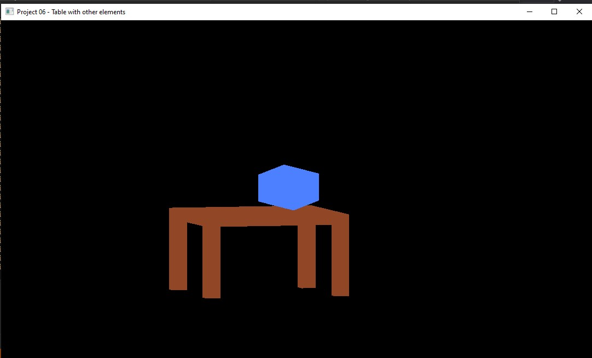

# Project 06 - v02
## Table with Icosahedron, interative mode. 

In this project you can draw a cube with rotations. This project has users interactions.

### Speed kyes: 
   - '+' : plus 0.1
   - '-' : minus 0.1 
  

### Zoom and Positions 
  -  Up arrow : Zoom out
  - Down arrow : Zoom in
  - Left arrow : Translate to left
  - Right arrow :  Translate to right

### Mouse locations

## One Example of execution:

